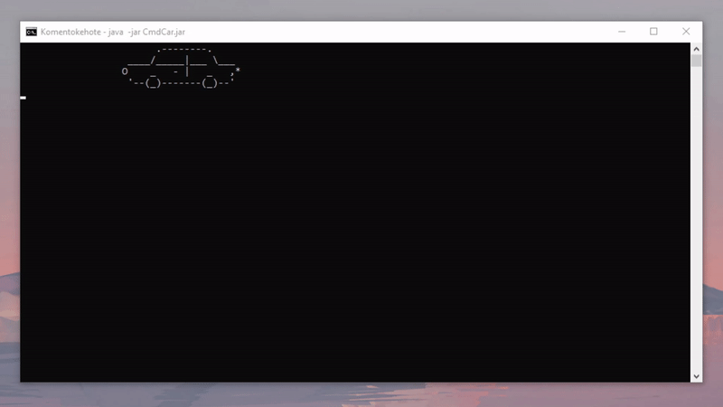

# Kotlin Windows Command-line Animatons
 Scripts made with Kotlin to animate Windows command-line

### How to run animations in the Windows command-line:
To run the animation on your local Windows computer you need to have JDK installed on your computer. If you want to compile the .jar file yourself you'll also need to have Kotlin Compiler.

#### Running the .jar file:
First, download the .jar file for the specific animation, navigate to the folder where you saved the -jar and run the following command:
```
java -jar selected_animation.jar
```

#### Compiling .jar from .kt file with Kotlin Compiler:
Download the .kt file containing the source code for the specific command-line animation. Navigate to the folder where you saved the -kt file and run the following command
to compile .jar file from the source:

```
kotlinc selected_animation.kt -include-runtime -d selected_animation.jar
```

## Available animations:
 
### Driving car

